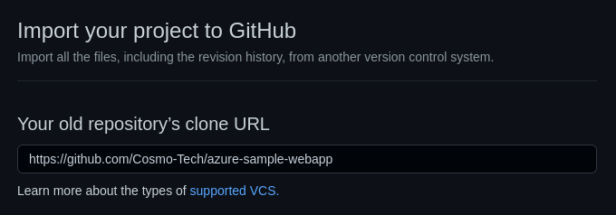

# Azure Sample Webapp

The ***Azure Sample Webapp*** aims to be an example of a [React](https://reactjs.org/) web application based on the [Cosmo Tech](https://cosmotech.com/) [Simulation Digital Twin Platform](https://portal.cosmotech.com/) and Azure cloud technology.\
This project demonstrates how to setup a web application with authentication, scenario management features and [PowerBI](https://powerbi.microsoft.com/en-us/) visualization.
It thus provides a fully configured solution **based on an example simulator** made using our Platform to illustrate the possible features (the example simulator, "Brewery", models customers satisfaction and beer stocks evolution in bars).

You can use this project as a base to build a front-end for your own Digital Twin solution.

To do that, **you need the Simulation Digital Twin Platform to be deployed in your Azure tenant** with a ready-to-use simulator.
Please note that we provide detailed step-by-step tutorials on [our portal](https://portal.cosmotech.com/) - Contact Cosmo Tech for access.

# Getting Started
Recommended Operating System: Debian (other OS have not been tested)
Supported browsers: Chromium 90, Chrome 91, Firefox 78

## Clone this project

The instructions below explain how to clone this project to build your own customized front-end for a Simulation Digital Twin
solution.

First, from the GitHub interface, [create a new repository](https://github.com/new/import) by importing the
azure-sample-webapp repository.



This will allow you to develop your own front-end using git, and still be able to receive the new features of the
azure-sample-webapp project.

You can now use the commands below to clone and configure your github project:
```
# Replace by the URL of your own repository (e.g. my-org/my-project.git)
git clone git@github.com:<YOUR_GITHUB_REPOSITORY_URL>  
cd <YOUR REPOSITORY_NAME>
git remote add upstream git@github.com:Cosmo-Tech/azure-sample-webapp.git
git remote set-url upstream --push "NO"
git fetch upstream
```
## Create an App registration, Azure Static Webapp resource & configure it for deployment

You need an Azure Static Webapp resource in the tenant to deploy your webapp.
For more information, follow our step-by-step tutorials on [our portal](https://portal.cosmotech.com/) - Contact Cosmo Tech for access.

## Configure the webapp for your use-case

The webapp must be configured so that it fits your simulation use-case (tenant ID, scenario parameters, visualization...).
Please refer to [Webapp configuration](doc/config.md)

## Start the webapp locally

This project is configured to be used with the [Yarn](https://yarnpkg.com/getting-started/install) package manager.
First, you have to start your Azure Functions, that are required for the PowerBI embedded reports to work correctly, with the commands below:
```
cd api
yarn install
yarn start
```

In another terminal, you can then start the webapp with:
```
yarn install
yarn start
```

Please note that the `yarn install` command is only necessary if the dependencies have not been installed, you do not
need to use this command every time.

## Available Scripts

### React scripts
This application has been created with *create-react-app*, that provides some scripts directly in the project directory.

#### `yarn start`

Runs the app in the development mode.\
Open [http://localhost:3000](http://localhost:3000) to view it in the browser.

The page will reload if you make edits.\
You will also see any lint errors in the console.

#### `yarn test`

Launches the test runner in the interactive watch mode.\
See the section about [running tests](https://facebook.github.io/create-react-app/docs/running-tests) for more information.

#### `yarn build`

Builds the app for production to the `build` folder.\
It correctly bundles React in production mode and optimizes the build for the best performance.

The build is minified and the filenames include the hashes.\
Your app is ready to be deployed!

See the section about [deployment](https://facebook.github.io/create-react-app/docs/deployment) for more information.

#### `yarn cache clean --force && rm -rf node_modules && yarn install`

Clean the cache being sure to avoid packages and dependencies issues.

### Other scripts
#### [`i18next`](https://react.i18next.com/) - translation handling
We have defined our own i18next-parser.config.js file.

Once you had launched the command `yarn install`, you'll be able to run the command `i18next` in the project root folder.
This command will :
- look for react-i18next usage within the __src/__ folder
- get all keys defined
- add all keys into translation files (by default __public/locales/en/translation.json__ and __public/locales/fr/translation.json__)
Feel free to add new supported languages or change the parser configuration. ( See [react-i18next](https://github.com/i18next/react-i18next) and [i18next-parser](https://github.com/i18next/i18next-parser) )

## Deploy your webapp

You can use continuous deployment to trigger deployment when committing.
