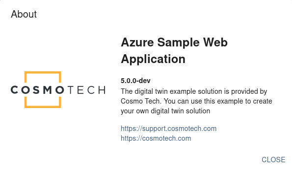

# Project branding

This section of the documentation explains how you can adapt some parts of the webapp to your organization and project.
The following elements are described in this page:

- changing the application title
- customizing the "About" component

If you're interested in changing the visual theme if the webapp, please refer to the
[Theme Customization](themeCustomization.md) page.

## Redefining webapp labels

Integrators can use custom translation files to override the default labels defined by the Cosmo Tech sample webapp.

All default labels are defined in the file _public/locales/{lang}/translation.json_ , with `{lang}` being either "en" or
"fr". When creating a new webapp for your project, you're not supposed to modify this _translation.json_ file, because
it could cause conflicts during future upgrades of the sample webapp. If you want to replace default labels by your
custom values, **you must use the file _public/locales/{lang}/custom.json_**.

The structure of both files _translation.json_ and _custom.json_ is the same: a **JSON file containing nested objects**.
By default, to display a label, the webapp will first search if the associated key exists in the file _custom.json_, and
if it is not found there, it will fall back to the value in _translation.json_. Although this documentation will only
present the most important labels you may want to change, please note that
**this mechanism gives you the possibility to overwrite any label in the webapp**: you just need to find the label key
in the _translation.json_ file, and declare it with a different label in the _custom.json_ file.

Please note though that the nested structure and the names of the properties in the JSON files must be respected,
otherwise your custom labels may be ignored.

Also, if your application will be available in multiple languages, don't forget to set your custom labels in both
folders _public/locales/en_ and _public/locales/fr_.

### Most frequently changed labels

The title of the application appears in different places in the webapp, sometimes with a short description. Here are the
keys of the labels that you will probably want to customize:

- `commoncomponents.text.application.title`: application name, shown in the browser window title
- `commoncomponents.text.link.cosmotech`: contact information to ask an account from the login page
- `genericcomponent.dialog.about.title`: title of the "About" dialog
- `genericcomponent.dialog.about.content`: body of the "About" dialog
- `views.common.footer.text.companyname`: name of your organization, shown in the page footer in login pages
- `views.common.footer.text.poweredby`: "Powered by ..." message, shown in the page footer in login pages
- `views.signin.title`: name of your application, displayed in the main login page

### Example of custom.json file

Here is a template you can use for the custom.json file:

```js
{
  "commoncomponents": {
    "text": {
      "application": {
        "title": "Cosmo Tech Web Application Sample"
      },
      "link": {
        "cosmotech": "Please contact Cosmo Tech"
      }
    }
  },
  "genericcomponent": {
    "dialog": {
      "about": {
        "title": "Azure Sample Web Application",
        "content": "The digital twin example solution is provided by Cosmo Tech. You can use this example to create your own digital twin solution"
      }
    }
  },
  "views": {
    "common": {
      "footer": {
        "text": {
          "companyname": "Cosmo Tech",
          "poweredby": "Powered by Cosmo Tech"
        }
      }
    },
    "signin": {
      "title": "Azure Sample Web Application"
    }
  }
}
```

## About component customization



By default, the azure-sample-webapp provides a custom "_About_" message displayed in a pop-up, accessible via the "Help"
menu in the top right corner. This dialog provides users with details about the **webapp version**, a **short
description**, and **Cosmo Tech contact information**, but you can adapt its content if you wish to do so. This section
will present how to configure minor changes to the default component, and how you can provide your own React component
to replace the default one.

### Configuration of the default "About" component

The default React component for the "About" section can be found in
[src/components/AboutContent/AboutContent.js](../src/components/AboutContent/AboutContent.js). Please note though that
**it is strongly advised not to modify this file directly**, to minimize the risk of conflicts with future updates of
the webapp.

Several parts of the default content can be configured:

- the title and description
- the organization logo
- the version number
- links to the support page and to your organization website

#### Title & description

As shown in the previous section, you can change the title and body of the About dialog, by setting custom values in the
files _public/locales/en/custom.json_ and _public/locales/fr/custom.json_, for the keys
`genericcomponent.dialog.about.title` and `genericcomponent.dialog.about.content`.

#### Organization logo

The organization logo can be replaced in the theme configuration: please refer to
[HelpMenu Configuration](helpMenuConfiguration.md).

#### Webapp version number

The webapp version number can be configured in
[src/config/HelpMenuConfiguration.json](../src/config/HelpMenuConfiguration.json), in the `APP_VERSION` field. Yet,
instead of hard-coding the version number in this configuration file (which would make the release process error-prone),
the version number is automatically set on webapp start (in "local dev" mode) or during the webapp build (for deployed
webapps), based on the version number in the [package.json](../package.json) file:

```json
{
  "name": "azure-sample-webapp",
  "version": "5.0.0"
}
```

The npm scripts "start" and "build" in the [package.json](../package.json) file are responsible for setting the
environment variable `REACT_APP_APP_VERSION`. If you prefer to use the hard-coded value in the configuration file
instead, then you have to remove the part `REACT_APP_APP_VERSION=$npm_package_version` in the
scripts, in the [package.json](../package.json) file. Replace:

```json
"scripts": {
  "start": "cross-env ESLINT_NO_DEV_ERRORS=true REACT_APP_APP_VERSION=$npm_package_version react-app-rewired start",
  "build": "cross-env DISABLE_ESLINT_PLUGIN=true REACT_APP_APP_VERSION=$npm_package_version react-app-rewired build"
}
```

by:

```json
"scripts": {
  "start": "cross-env ESLINT_NO_DEV_ERRORS=true react-app-rewired start",
  "build": "cross-env DISABLE_ESLINT_PLUGIN=true react-app-rewired build"
}
```

#### Link to support page & organization website

These links can be defined in several ways:

- the most straightforward way is to set the values `ORGANIZATION_URL` and `SUPPORT_URL` in the file
  _src/config/HelpMenuConfiguration.json_
- for automation purposes, these parameters can be overridden by setting the environment variables
  `REACT_APP_ORGANIZATION_URL` and `REACT_APP_SUPPORT_URL`
- finally, values for these links can be **customized for each workspace**, by setting these parameters in the workspace
  data:

  - `[workspace].webApp.options.menu.supportUrl`
  - `[workspace].webApp.options.menu.organizationUrl`

For labels translations, you can see this section:
[Application title and company contact link](#application-title-and-company-contact-link)

### Replacing the About component

If you prefer to write your own React component, open the file
[src/services/config/Menu.js](../src/services/config/Menu.js) and replace the imported component:

```js
import { MyCustomComponent } from '../../components/MyCustomComponent';
export const About = MyCustomComponent;
```

### Disabling the About pop-up

Finally, if you'd rather not display any "About" pop-up and remove the associated item in the "Help" menu, open the file
[src/services/config/Menu.js](../src/services/config/Menu.js) and set the exported variable to `null`:

```js
export const About = null;
```
