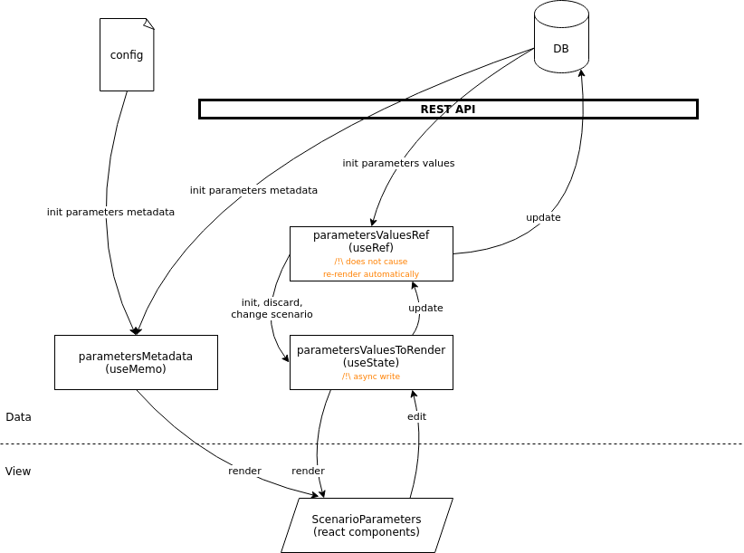

# Scenario parameters customization

This document describes advanced methods to customize the scenario parameters view (custom parameters input, custom
tabs). It will require basic skills in React, and some knowledge of the webapp structure.

If you want to only apply minimal changes on the layout that is automatically generated, please refer to the
[scenario parameters configuration](./scenarioParametersConfiguration.js) section.

## Structure & concepts

### ScenarioParameters state structure

One of the challenge to automatically generate the scenario parameters tabs and to fill them with input components is
to handle the state for all these components. The data required to generate the user interface can be divided in three
parts: the **parameters metadata**, a **reference to the parameters values**, and some **rendering data** to represent
the parameters values in input components.

#### Metadata

The parameters metadata are obtained by merging data from the **solution description** (the webapp receives them on
initialization) and from the **scenario parameter configuration file**. These data are not meant to change during the
user session, they can thus be memorized in the React component to prevent unnecessary computations during each render.

The parameters metadata are stored in the variable `parametersMetadata` in the ScenarioParameters component, declared
thanks to the `useMemo` hook.

Some examples of parameters metadata are the _varType_, default value, min and max values, or translation labels.

#### Reference

The parameters values reference represent a buffer for the data received by the Cosmo API, or that will be sent to the
Cosmo API. Although the API uses strings to exchange parameters values, the parameters values reference store these
values after having cast them to a more specific JS type when possible (e.g. a parameter with a _varType_ "int" will be
stored as a JS number).

These data are stored in the variable `parametersValuesRef` in the ScenarioParameters component by using the `useRef`
hook. It has the advantages of synchronous read & write, which is necessary to make sure that we will send up-to-date
data to the API when updating the scenario parameters (as opposite to a `useState` hook that could have write operations
delayed by the batch update mechanism).

The drawback of the `useRef` hook is that modifications of these data may not trigger a re-render of the graphical
components. Furthermore, because the data in this buffer reflect the data that is exchanged with the Cosmo API,
sometimes it is not sufficient for the needs of the React components responsible of the user input. Hence the need for
the last type of parameters data: the rendering data.

Example: for a parameter with _varType_ "%DATASETID%", the parameter value reference only contains a string that
represents the dataset identifier.

#### Rendering data

The rendering data represent the actual state of the parameters values, that is used in the React components responsible
for the scenario parameters edition. Every change in this state will trigger a re-render of the input components,
allowing users to edit the parameters values.

Thse data are declared in the ScenarioParameters component in a variable named `parametersValuesToRender`, with the
`useState` hook.

Example: for a parameter with _varType_ "%DATASETID%", the rendering data contain the current status of the file
parameter, and the name of the file if one has been uploaded.

#### ScenarioParameters state structure schema

The diagram below illustrates these three type of parameters data and how they are used to render input components,
edit and update the scenario parameters values.



### Tabs and inputs components
In ScenarioParameters.js file all parameters data are rendered by ScenarioParametersTabsWrapper component which generate
generic and custom tabs by calling the corresponding component. Tab component has the following props:
- the parameters metadata
- the parameters value in a React state (from the rendering data in the state of ScenarioParameters component)
- a function to set the parameters state (in the rendering data too)
- a context object to pass all additional information. It always contains a
  boolean defining whether the edition mode is enabled (to disable user input if required)

Then, the tab component passes these props to the input components specific for each varType. 

Generic tabs and inputs components are provided to support the file parameters and the basic types, but the following section will
describe how you can create your own components to customize the scenario parameters panel.

_**N.B.1**_

Factories (functions whose goal is to generate, for a given scenario parameter or parameter group, the React
component) used in the web app prior to v.3.0.0 are now deprecated and won't be supported
in the next major version of the webapp; all generic tabs and inputs have been transformed into React components.

## Customization

### Define a custom _varType_

Although basic standard types (enum, string, int, number, bool, date), and file parameters are already supported, you
may want to define scenario parameters with your own custom types to change the default handling of a type. For each new
_varType_, there are four information to provide:

- a default value for this type of parameter (used when a user creates a new scenario)
- a serialization function to convert this type to string (used when sending the parameters values to the API)
- a deserialization function to convert this type from a string (used when receiving the parameters values from the API)
- a React component that will be used for user input for all parameters with this type

These information must be defined in dicts, with your _varType_ as key, in the following files:

- [src/utils/scenarioParameters/custom/DefaultValues.js](../src/utils/scenarioParameters/custom/DefaultValues.js)
- [src/utils/scenarioParameters/custom/ConversionFromString.js](../src/utils/scenarioParameters/custom/ConversionFromString.js)
- [src/utils/scenarioParameters/custom/ConversionToString.js](../src/utils/scenarioParameters/custom/ConversionToString.js)
- [src/utils/scenarioParameters/custom/VarTypesComponentsMapping.js](../src/utils/scenarioParameters/custom/VarTypesComponentsMapping.js)

You will then be able to declare parameters with your custom _varType_ in the YAML solution description, and the webapp
will automatically generate the associated components.

### Extended _varTypes_

In some cases you may want to define a **sub-type** to have a distinction between several parameters with the same
_varType_. For instance, the specific _varType_ `%DATASETID%` is used for all dataset parts, but you may need to display
different component in the webapp for some file parameters (e.g; a file upload and a table that users can edit).

To define an extended var type, you must add a `subType` property in your parameter configuration:

- `subType` (optional): define a varType suffix to handle this parameter as a custom varType

Example:

```
const PARAMETERS = {
  my_dataset_part_paramaete: {
    connectorId: 'C-xxxxxxxxxx',
    defaultFileTypeFilter: '.zip,.csv,.json,.xls,.xlsx',
    description: 'Initial stock dataset part',
    subType: 'TABLE'
  },
};
```

If the _varType_ of the parameter above is `%DATASETID%`, then the extended _varType_ for this parameter will be
`%DATASETID%-TABLE`.

You will then be able to use this extended _varType_ in the four mapping files (see section "Define a custom
_varType_"). For any of those files, if the extended _varType_ of a parameter is not found in the mapping dict, the
webapp will fallback on its _varType_. This means that if you want to keep the same behavior for an extended _varType_
as for the orgiinal _varType_, you can omit to declare the extended varType in the mapping dicts.

### Create custom input components

Creating your own input components can be useful if you want to replace the existing components for basic types, or if
you want to add your own custom _varType_.

1. first you will need to create a React component to define the input UI and behavior (example:
   [BasicNumberInput](https://github.com/Cosmo-Tech/webapp-component-ui/blob/main/src/inputs/BasicInputs/BasicNumberInput/BasicNumberInput.js))
2. then you must define an input component that will connect the parameter data to the props of your component (example: [GenericNumberInput](../src/components/ScenarioParameters/components/ScenarioParametersInputs/GenericNumberInput.js))
3. you can then import and use this component in the [custom varTypes components mapping file](../src/utils/scenarioParameters/custom/VarTypesComponentsMapping.js) of your application (you can override the default components by adding
   generic types in the custom mapping dict)

### Create custom scenario parameters tabs

If you want to customize the layout of generated tabs, you can create your own tab component.
You can add a specific behavior based on the id of the parameter group if you want a custom tab for only
one parameter group. The ScenarioParametersTabsWrapper component calls a custom tabs component if the parameters group id is declared in
`CUSTOM_PARAMETERS_GROUPS_COMPONENTS_MAPPING` in [src/utils/scenarioParameters/custom/ParametersGroupsComponentsMapping.js](../src/utils/scenarioParameters/custom/ParametersGroupsComponentsMapping.js). If your custom tab 
needs other information than generic one, you can pass it through ScenarioParametersTabsWrapper component via `context` prop.

