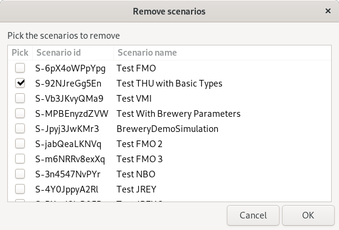

## Available Scripts

### `python3 delete_scenarios.py API_NAME ORGANIZATION_ID WORKSPACE_ID`

Script dependencies:
* restish: https://rest.sh
* zenity: `sudo apt-get install zenity` or `brew install homebrew/x11/zenity`

This script lets the user select a scenario and deletes the selected scenario
from the cloud database. The scenario results are not removed by this command.

When the command is run, a window opens to let users select the scenarios to
remove.

